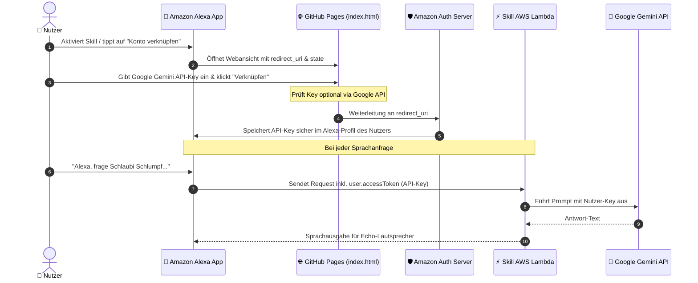

# 🧙‍♂️ Schlaubi Schlumpf – Gemini API-Key Setup (Alexa Account Linking)

Eine schlanke, serverlose GitHub Pages Web-App zur Verknüpfung persönlicher **Google Gemini API-Keys** mit dem Amazon Alexa Skill **„Schlaubi Schlumpf“** via **OAuth 2.0 Implicit Grant**.

---

## 🌟 Überblick & Funktionsweise

Amazon erlaubt aus Genauigkeits- und Sicherheitsgründen keine direkte Spracheingabe langer Passwörter oder API-Keys auf Echo-Geräten. Stattdessen setzt diese Lösung auf den offiziellen **Alexa Account Linking (Implicit Grant)** Mechanismus:



### Die großen Vorteile dieses Ansatzes:

1. **Zero-Database & Zero-Server:** Es wird keine externe Datenbank (DynamoDB, Firebase etc.) benötigt. Amazon speichert den API-Key für jeden Nutzer verschlüsselt und liefert ihn automatisch bei jedem Aufruf im Request mit.
2. **100 % Client-Side & Sicher:** Die gesamte GitHub Pages Seite läuft statisch im Browser des Nutzers. Über das URL-Fragment (`#access_token=...`) gelangt der Key direkt zu Amazon und berührt zu keinem Zeitpunkt fremde Server.
3. **Vollständige Zertifizierungs-Konformität:** Integrierte Datenschutzerklärung (`#datenschutz`) und Nutzungsbedingungen (`#nutzungsbedingungen`) erfüllen direkt die Anforderungen für den Amazon Alexa Skill Store.
4. **Key-Validierung vor Ort:** Nutzer können ihren Key vor der Verknüpfung direkt gegen Googles API testen, um Tippfehler zu vermeiden.

---

## 🚀 Schritt 1: GitHub Pages aktivieren

1. GitHub Remote einrichten (falls noch nicht geschehen):
   ```bash
   git remote add origin https://github.com/<dein-github-benutzername>/schlaubi-schlumpf-apikey-setup.git
   ```
2. Projekt direkt über die Kommandozeile bereitstellen:
   ```bash
   npm run deploy
   ```
   Dieser Befehl prüft offene Änderungen und pusht den aktuellen Stand zu GitHub. Die integrierte GitHub Action (`.github/workflows/deploy.yml`) baut und veröffentlicht die Seite automatisch auf GitHub Pages.

3. Im GitHub-Repository unter **Settings** &rarr; **Pages**:
   - **Source**: `GitHub Actions` (oder `Deploy from a branch` &rarr; `main` / `/ (root)`)
4. Deine Seite ist erreichbar unter:
   `https://<dein-github-benutzername>.github.io/schlaubi-schlumpf-apikey-setup/`

---

## ⚙️ Schritt 2: Account Linking in der Alexa Developer Console einrichten

1. Öffne die [Alexa Developer Console](https://developer.amazon.com/alexa/console/ask) und wähle deinen Skill **Schlaubi Schlumpf**.
2. Klicke im linken Menü unter **TOOLS** auf **Account Linking**.
3. Aktiviere den Schalter:
   - **Do you allow users to create an account or link to an existing account with you?** &rarr; **Yes**.
4. Wähle als Grant-Typ:
   - 🔘 **Implicit Grant** _(wichtig: nicht "Auth Code Grant")_.
5. Trage folgende Werte ein:
   - **Authorization URI**:  
     `https://<dein-github-benutzername>.github.io/schlaubi-schlumpf-apikey-setup/`
   - **Client ID**:  
     `alexa-schlaubi-schlumpf` _(beliebiger Bezeichner)_
   - **Scopes**:  
     `gemini` _(oder leer lassen)_
   - **Domains**:  
     `<dein-github-benutzername>.github.io`
6. Klicke oben rechts auf **Save**.

---

## 📋 Schritt 3: URLs für Store-Zertifizierung hinterlegen

Amazon verlangt für Skills mit Account Linking zwingend Links zu Datenschutz und Nutzungsbedingungen. Diese sind direkt in dieser GitHub Pages App integriert:

- **Privacy Policy URL**:  
  `https://<dein-github-benutzername>.github.io/schlaubi-schlumpf-apikey-setup/#datenschutz`
- **Terms of Use URL**:  
  `https://<dein-github-benutzername>.github.io/schlaubi-schlumpf-apikey-setup/#nutzungsbedingungen`

Trage diese beiden Links im Reiter **Distribution** &rarr; **Privacy & Compliance** in der Alexa Developer Console ein.

---

## 💻 Schritt 4: Skill Lambda-Code anpassen

Bisher hatte dein Skill einen fest einprogrammierten API-Key. Ersetze diesen durch den `accessToken` aus dem Request-Envelope:

### Beispiel in TypeScript:

```typescript
import { HandlerInput, RequestHandler } from 'ask-sdk-core'
import { Response, IntentRequest } from 'ask-sdk-model'

export const AskGeminiIntentHandler: RequestHandler = {
  canHandle(handlerInput: HandlerInput): boolean {
    return (
      handlerInput.requestEnvelope.request.type === 'IntentRequest' &&
      handlerInput.requestEnvelope.request.intent.name === 'AskGeminiIntent'
    )
  },

  async handle(handlerInput: HandlerInput): Promise<Response> {
    // 1. Hole den verknüpften API-Key (accessToken) aus dem Kontext
    const accessToken =
      handlerInput.requestEnvelope.context.System.user.accessToken

    // 2. Falls noch nicht verknüpft: Fordere den Nutzer mit einer Karte auf
    if (!accessToken) {
      return (
        handlerInput.responseBuilder
          .speak(
            'Hallo! Um Schlaubi Schlumpf zu nutzen, verknüpfe bitte zuerst deinen Google Gemini API-Key in der Alexa-App.',
          )
          // withLinkAccountCard erzeugt die "Konto verknüpfen" Schaltfläche in der Alexa-App
          .withLinkAccountCard()
          .getResponse()
      )
    }

    const request = handlerInput.requestEnvelope.request as IntentRequest
    const question =
      request.intent.slots?.question?.value || 'Erzähle mir einen Witz.'

    try {
      // 3. Verwende den individuellen Key des Nutzers für den Gemini-Aufruf
      const answer = await queryGemini(question, accessToken)
      return handlerInput.responseBuilder
        .speak(`<lang xml:lang="de-DE">Schlaubi sagt:</lang> ${answer}`)
        .getResponse()
    } catch (error: any) {
      // Falls der Key ungültig oder widerrufen wurde:
      if (error?.status === 400 || error?.status === 403) {
        return handlerInput.responseBuilder
          .speak(
            'Dein hinterlegter Google API-Key ist leider ungültig. Bitte hinterlege einen neuen Schlüssel in der Alexa-App.',
          )
          .withLinkAccountCard()
          .getResponse()
      }
      throw error
    }
  },
}
```

Ein vollständiges, sofort einsatzbereites TypeScript-Beispiel findest du in [`examples/lambda-handler-example.ts`](file:///workspaces/schlaubi-schlumpf-apikey-setup/examples/lambda-handler-example.ts).

---

## 🧪 Lokale Entwicklung & Tests

### 1. Lokal im Browser öffnen

Starte einen lokalen Webserver:

```bash
python3 -m http.server 8000
```

Öffne `http://localhost:8000` im Browser.

### 2. Entwickler- & Simulations-Modus nutzen

Wenn die Seite direkt im Browser aufgerufen wird (ohne von Alexa geöffnet worden zu sein), zeigt die App automatisch einen Hinweis an.

Unten auf der Seite findest du den Link **🛠️ Entwickler- & Test-Modus**:

1. Klicke auf **Entwickler- & Test-Modus**.
2. Es werden simulierte Parameter für `redirect_uri` und `state` eingeblendet.
3. Du kannst einen Key eingeben, auf **Key testen** klicken (prüft echten Gemini-Zugriff) und die erzeugte Weiterleitungs-URL inspizieren.

---

## 📁 Projektstruktur

```
schlaubi-schlumpf-apikey-setup/
├── index.html                       # Hauptseite (Verknüpfungsformular, Anleitung, Rechtliches)
├── style.css                        # Modernes, barrierefreies Styling (Hell/Dunkel, Mobil-optimiert)
├── app.js                           # OAuth Implicit Grant Logik, Key-Tester, i18n
├── favicon.svg                      # Logo & Favicon
├── .nojekyll                        # Verhindert Jekyll-Build auf GitHub Pages
├── README.md                        # Dieses Dokument
└── examples/
    └── lambda-handler-example.ts    # Referenzcode für den Alexa Skill Lambda Handler
```

---

## 🔒 Datenschutz & Sicherheit

- **Keine Server:** Keine Benutzerdaten, Cookies oder API-Keys werden auf GitHub Pages oder fremden Webservern gespeichert.
- **RFC 6749 Konformität:** Die Übertragung des Tokens erfolgt im URI-Fragment (`#access_token=...`), welches laut HTTP-Spezifikation vom Browser niemals an Webserver übertragen wird.
- **Widerruf:** Nutzer können ihren API-Key jederzeit mit einem Klick in der Alexa App trennen oder in Google AI Studio löschen.
